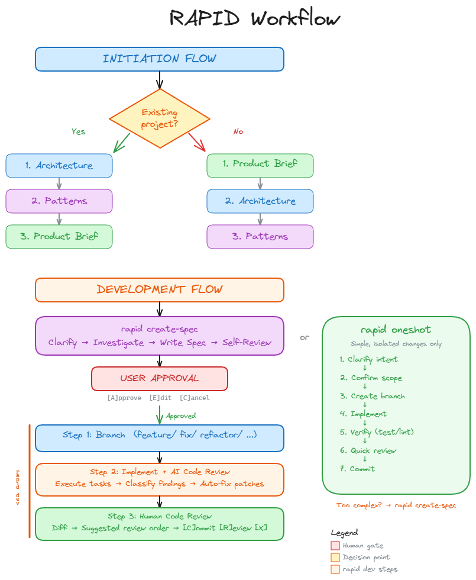

# RAPID Workflow

RAPID has two flows: **Initiation** (set up your project) and **Development** (build features).

## Flow Overview



---

## Initiation Flow

The initiation flow sets up project knowledge that every development task will use.

### Existing Project

If you already have code, start by documenting what exists:

```
rapid create-architecture  →  rapid create-patterns  →  rapid create-brief
```

1. **Architecture** — Auto-detects tech stack, documents structure, modules, dependencies
2. **Patterns** — Scans code for conventions, validates with you, creates standards doc
3. **Product Brief** — Defines the next feature or product requirements

### New Project

If starting from scratch, define what you're building first:

```
rapid create-brief  →  rapid create-architecture  →  rapid create-patterns
```

1. **Product Brief** — Vision, target users, core features, success metrics
2. **Architecture** — Plan the tech stack, structure, and key modules
3. **Patterns** — Set coding standards before the first line of code

---

## Development Flow

### `rapid create-spec` — Tech Spec

**Purpose**: Plan before you code. The spec is the contract between intent and implementation.

#### What happens

1. **Clarify** — Understand the user's intent. If ambiguous, **stop and ask**.
2. **Investigate** — Read relevant code, understand patterns, identify dependencies
3. **Write Spec** — Fill the template:

   | Section | Content | Frozen? |
   |---------|---------|---------|
   | **Intent** | Problem + Approach | Yes |
   | **Boundaries** | Always / Ask First / Never | Yes |
   | **I/O & Edge Cases** | Scenarios table | Yes |
   | **Code Map** | Files and roles | No |
   | **Tasks** | Ordered with file paths | No |
   | **Acceptance Criteria** | Given/When/Then | No |
   | **Verification** | Commands to run | No |

4. **Self-Review** — Verify the spec is actionable, logical, testable, complete
5. **User Approval** — `[A]pprove` / `[E]dit` / `[C]ancel`

#### Frozen sections

After approval, **Intent**, **Boundaries**, and **I/O** are locked. Implementation reads these sections on every task to prevent scope creep.

#### Output
- Spec file in `_rapid/output/specs/` with status `ready-for-dev`

---

### `rapid dev` — Development

**Purpose**: Implement the approved spec with AI code review.

**Prerequisite**: An approved spec with status `ready-for-dev`.

#### Step 1: Branch

- Read the approved spec
- Create a semantic branch (`feature/`, `fix/`, `refactor/`, `chore/`, `docs/`, `perf/`, `hotfix/`)
- Confirm with user

#### Step 2: Implement + AI Code Review

- Capture baseline commit
- Execute each task from the spec, following frozen sections
- Follow `project-patterns.md` conventions
- Run tests, build, and lint
- **AI self-review** — check against spec intent, ACs, patterns, edge cases
- **Classify findings**:

  | Type | Action |
  |------|--------|
  | `intent_gap` | **HALT** — needs user decision |
  | `bad_spec` | Note for user |
  | `patch` | Auto-fix immediately |
  | `defer` | Add to backlog |
  | `noise` | Ignore |

#### Step 3: Human Code Review

- Generate diff from baseline
- Create suggested review order (by concern, entry points first)
- Present results with verification status
- User decides: `[C]ommit` / `[R]eview diff` / `[X] Discard`

#### Output
- Code committed on feature branch, ready for human PR creation

---

### `rapid oneshot` — Fast Path

**Purpose**: Skip the spec for trivial, isolated changes.

**When to use** — ALL must be true:
- No architectural decisions
- No shared state modified
- Clear, isolated change
- Crystal clear intent

#### Flow

```
Clarify → Confirm scope → Branch → Implement → Verify → Quick review → Present → Commit
```

If the change turns out to be complex, the oneshot **escalates** to `rapid create-spec`.
